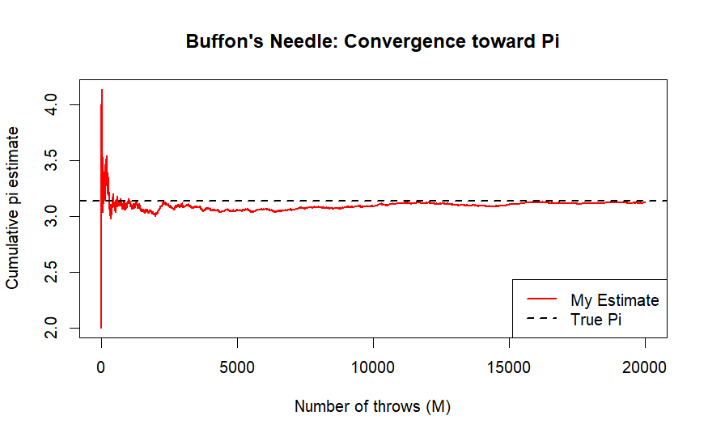
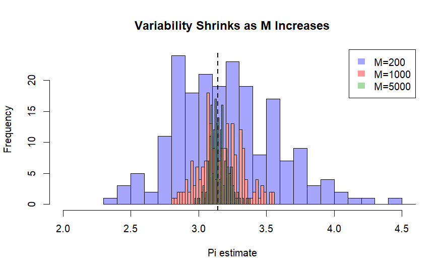

## Buffon's Needle: Estimating Pi using Monte Carlo

**Author:** Sami HNAIEN  
**Course:** Statistical Theory - University of Milan (UNIMI)

This project explores the **Buffon's Needle problem**, a classic probability experiment used to estimate the value of **π** through simulation.


## Objective


The goal is to demonstrate the **Law of Large Numbers** by simulating the drop of a needle on a floor with parallel lines and observing how the estimate stabilizes over time.


---

## Project Structure

```
.
├── code
│   └── buffon_simulation.R      # Main simulation script (R)
├── docs
│   └── presentation.pdf         # Project presentation 
└── plots
     ├── cumulative_pi.png        # Convergence plot (Red line)
     └── estimate_histograms.png  # Variance\Sampling distribution
```

---

## Methodology


**Trials (M)**: 20,000 repetitions.

**Formula**: $\pi \approx \frac{2L}{dP}$.

**Crossing Condition**: A "hit" is recorded if $Y \leq \frac{L}{2} \sin(\theta)$.


## Visualizations


**1. Convergence toward π**


The red line shows the cumulative estimate of $pi$. As the number of trials ($M$) increases, the estimate converges and stabilizes around the real value of 3.14159 .




**2. Variability Analysis**

These histograms compare different sample sizes. As $M$ grows (from Blue to Green), the distribution becomes narrower, showing that larger samples significantly reduce estimation error.




## Tech Stack


**Language**: R

**Libraries**: Base R (stats & graphics)

**Concepts**: Monte Carlo Methods, Geometric Probability, Law of Large Numbers.


---


**Contact:** [samihnaien57@gmail.com]
